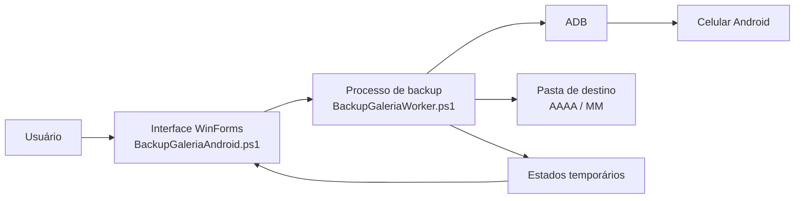

# Arquitetura

## Visão geral

O projeto é formado por uma interface gráfica e um processo de trabalho independente. Essa separação mantém a janela responsiva durante transferências grandes e permite interromper com segurança um `adb pull` em andamento.

## Componentes

### `Abrir Backup da Galeria.cmd`

Inicia o PowerShell em modo STA e oculta o console. A interface gráfica continua visível.

### `BackupGaleriaAndroid.ps1`

Responsável por:

- montar a interface WinForms;
- detectar e identificar o aparelho autorizado;
- escolher o destino;
- iniciar o processo de trabalho;
- acompanhar estados independentes gravados no diretório temporário;
- solicitar cancelamento seguro;
- exibir resultado e falhas.

### `BackupGaleriaWorker.ps1`

Responsável por:

- procurar mídias nas pastas configuradas;
- consultar o tamanho remoto;
- copiar um arquivo por vez para `.transferindo`;
- interromper o processo ADB quando solicitado;
- determinar a data da mídia;
- mover a cópia validada para `AAAA\MM`;
- atualizar o manifesto e o relatório.

### `platform-tools`

Contém o executável ADB e suas bibliotecas para Windows. Outros componentes do Android Platform Tools não são necessários para este projeto.

## Determinação da data

A data usada para criar as pastas segue esta prioridade:

1. `DateTimeOriginal` nos metadados EXIF de JPEG/JPG.
2. Data no nome do arquivo, nos formatos comuns `AAAAMMDD`, `AAAA-MM-DD` ou `AAAA_MM_DD`.
3. Data de modificação da cópia local como alternativa.

O log da interface identifica a origem como `metadata`, `nome` ou `arquivo`.

## Prevenção de duplicatas

O manifesto `.backup-celular.json` relaciona o caminho remoto ao caminho local e ao tamanho do arquivo. Na execução seguinte, um item é ignorado quando o destino ainda existe e possui o tamanho registrado.

Se já existir um arquivo de mesmo nome e tamanho na pasta calculada, ele é reutilizado. Se o tamanho for diferente, o programa adiciona um número ao nome, por exemplo `IMG_0001 (2).jpg`.

## Comunicação entre processos

Cada atualização de progresso é gravada em um arquivo de estado exclusivo no diretório temporário do Windows. A interface lê apenas arquivos já fechados e remove estados antigos. Essa estratégia evita que leitura e escrita disputem o mesmo arquivo.

O cancelamento utiliza um arquivo sinalizador. Durante uma transferência, o processo de trabalho verifica esse sinal a cada 250 ms, encerra apenas o processo local do ADB e remove a cópia parcial.
